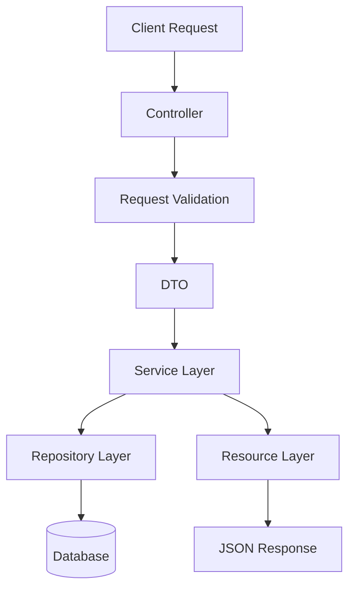

# Leave Management API

A RESTful Leave Management API built using Laravel 12.

This project provides authentication, leave request management, leave approval workflows, OAuth login, and role-based authorization using a clean layered architecture approach.

---

# Features

## Authentication

- Register
- Login
- Logout
- Laravel Sanctum Token Authentication
- Google OAuth Login

---

## Employee Features

- Create leave request
- Upload leave attachment
- View leave history

---

## Admin Features

- View pending leave requests
- Approve leave request
- Reject leave request

---

## Business Rules

- Leave overlap validation
- Annual leave quota validation
- Only pending leaves can be approved/rejected
- Role-based access control

---

# Tech Stack

- Laravel 12
- PHP 8+
- MySQL
- Laravel Sanctum
- Laravel Socialite
- PHPUnit

---

# Architecture

This project uses a layered architecture pattern:



````

Detailed architecture documentation & erd:

- [Architecture Documentation](docs/architecture.md)
- [ERD](docs/leave-management-erd.png)
- [Laravel](docs/laravel.md)

---

# Installation

## Clone Repository

```bash
git clone <repository-url>

cd leave-management-api
```

---

## Install Dependencies

```bash
composer install
```

---

## Environment Setup

```bash
cp .env.example .env
```

Generate application key:

```bash
php artisan key:generate
```

---

## Configure Database

Update your `.env` file:

```env
DB_DATABASE=leave_management_api
DB_USERNAME=root
DB_PASSWORD=
```

---

## Configure Google OAuth

```env
GOOGLE_CLIENT_ID=
GOOGLE_CLIENT_SECRET=
GOOGLE_REDIRECT_URI=${APP_URL}/api/auth/google/callback
```

---

## Run Migration & Seeder

```bash
php artisan migrate --seed
```

---

## Create Storage Link

```bash
php artisan storage:link
```

---

## Start Development Server

```bash
php artisan serve
```

---

# Running Tests

Run all tests:

```bash
php artisan test
```

Run specific tests:

```bash
php artisan test --filter=AuthTest

php artisan test --filter=LeaveRequestTest

php artisan test --filter=LeaveApprovalTest

php artisan test --filter=LeaveServiceTest
```

---

# API Endpoints

## Authentication

| Method | Endpoint             | Description       |
| ------ | -------------------- | ----------------- |
| POST   | `/api/auth/register` | Register new user |
| POST   | `/api/auth/login`    | Login user        |
| POST   | `/api/auth/logout`   | Logout user       |

---

## OAuth

| Method | Endpoint                    | Description                   |
| ------ | --------------------------- | ----------------------------- |
| GET    | `/api/auth/google/redirect` | Get Google OAuth redirect URL |
| GET    | `/api/auth/google/callback` | Google OAuth callback         |

---

## Employee Routes

| Method | Endpoint               | Description          |
| ------ | ---------------------- | -------------------- |
| GET    | `/api/employee/leaves` | Get leave history    |
| POST   | `/api/employee/leaves` | Create leave request |

---

## Admin Routes

| Method | Endpoint                         | Description        |
| ------ | -------------------------------- | ------------------ |
| GET    | `/api/admin/leaves/pending`      | Get pending leaves |
| PATCH  | `/api/admin/leaves/{id}/approve` | Approve leave      |
| PATCH  | `/api/admin/leaves/{id}/reject`  | Reject leave       |

---

# Test Accounts

## Admin Account

```txt
email: admin@gmail.com
password: password
```

---

## Employee Account

```txt
email: employee@gmail.com
password: password
```

---

# Testing Coverage

## Feature Tests

- AuthTest
- LeaveRequestTest
- LeaveApprovalTest

---

## Unit Tests

- LeaveServiceTest

---

# Project Structure

```text
app/
├── DTOs/
├── Enums/
├── Exceptions/
├── Http/
├── Models/
├── Repositories/
├── Services/
└── Traits/
```

---

# Design Principles

- Separation of Concerns
- Layered Architecture
- Reusable Business Logic
- Clean API Response Structure
- Repository Pattern
- DTO Pattern
- Service Layer Pattern

---

# License

This project is for technical assessment and educational purposes.

```

```
````
