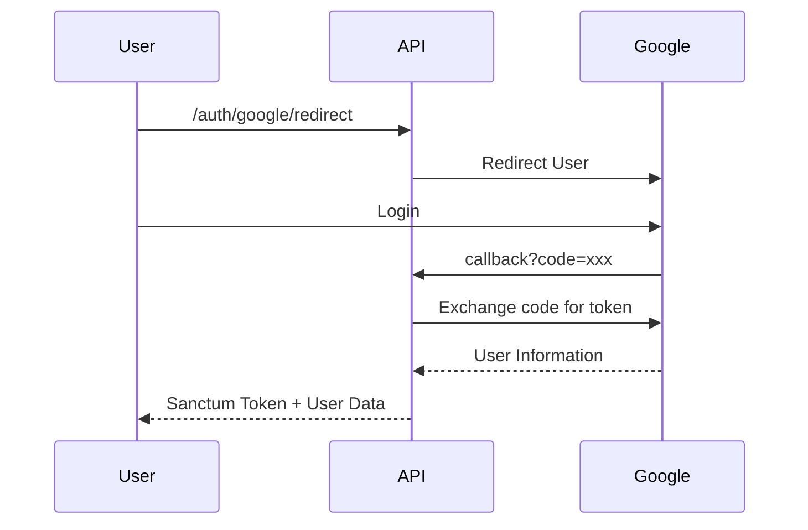
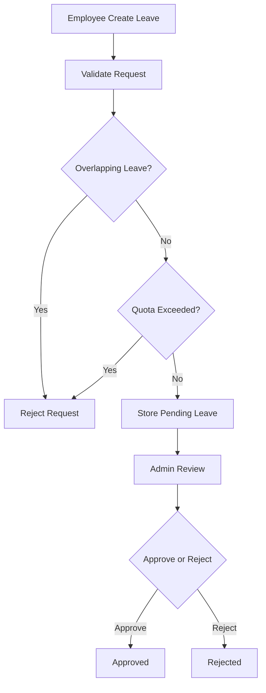

# Leave Management API Architecture

## Overview

This project uses a layered architecture pattern to separate responsibilities between application layers.

The architecture focuses on:

- clean code organization
- separation of concerns
- scalable structure
- reusable business logic
- maintainable API development

---

# High Level Architecture

```mermaid
graph TD

A[Client Request]
--> B[Controller Layer]

B --> C[Request Validation]
C --> D[DTO Layer]

D --> E[Service Layer]

E --> F[Repository Layer]
F --> G[(Database)]

E --> H[Resource Layer]
H --> I[JSON Response]
````

---

# Layer Responsibilities

## Controller Layer

Responsible for:

- handling HTTP requests
- calling services
- returning API responses

Controllers do not contain business logic.

Example:

- AuthController
- LeaveController
- LeaveApprovalController

---

## Request Validation Layer

Responsible for:

- validating incoming request data
- sanitizing user input

Example:

- LoginRequest
- RegisterRequest
- StoreLeaveRequest

---

## DTO Layer

DTO (Data Transfer Object) is used to transfer validated data between layers.

Benefits:

- cleaner service method signatures
- immutable structured data
- easier maintenance

Example:

- LoginDTO
- RegisterDTO
- CreateLeaveDTO

---

## Service Layer

Contains all business logic.

Responsibilities:

- leave quota validation
- overlapping leave validation
- approval & rejection rules
- authentication logic
- OAuth logic

Example:

- AuthService
- LeaveService
- OAuthService

---

## Repository Layer

Responsible for database abstraction and query handling.

Benefits:

- cleaner service layer
- reusable queries
- easier testing

Example:

- UserRepository
- LeaveRepository

---

## Resource Layer

Formats API responses consistently.

Responsibilities:

- transform model data
- hide unnecessary attributes
- standardize JSON structure

Example:

- UserResource
- LeaveResource
- AuthResource

---

## Middleware Layer

Responsible for:

- authentication
- authorization
- forcing JSON responses

Example:

- RoleMiddleware
- ForceJsonResponse

---

# Authentication Flow

```mermaid
sequenceDiagram

participant Client
participant API
participant AuthService
participant Repository
participant Database

Client->>API: Login Request

API->>AuthService: Validate Credentials

AuthService->>Repository: Find User By Email

Repository->>Database: Query User

Database-->>Repository: User Data

Repository-->>AuthService: User Model

AuthService-->>API: Sanctum Token

API-->>Client: JSON Response
```

---

# OAuth Authentication Flow



---

# Leave Request Flow



---

# Project Structure

```text
app/
├── DTOs/
├── Enums/
├── Exceptions/
├── Http/
│   ├── Controllers/
│   ├── Middleware/
│   ├── Requests/
│   └── Resources/
├── Models/
├── Providers/
├── Repositories/
├── Services/
└── Traits/
```

---

# Testing Strategy

The project uses two types of testing:

## Feature Tests

Used for:

- API endpoint testing
- authentication testing
- authorization testing
- request/response validation

Example:

- AuthTest
- LeaveRequestTest
- LeaveApprovalTest

---

## Unit Tests

Used for:

- business logic testing
- service layer validation
- edge case handling

Example:

- LeaveServiceTest

---

# Technologies Used

- Laravel 12
- Laravel Sanctum
- Laravel Socialite
- MySQL
- PHPUnit

---

# Design Principles

This project follows several software engineering principles:

- Separation of Concerns
- Single Responsibility Principle
- Layered Architecture
- Reusable Business Logic
- Clean API Response Structure

```

```
